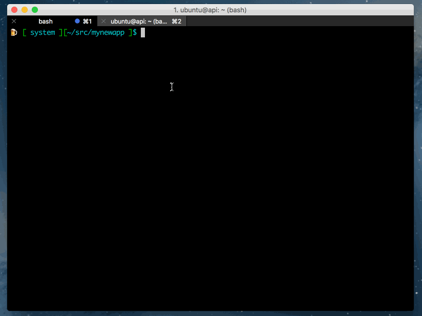
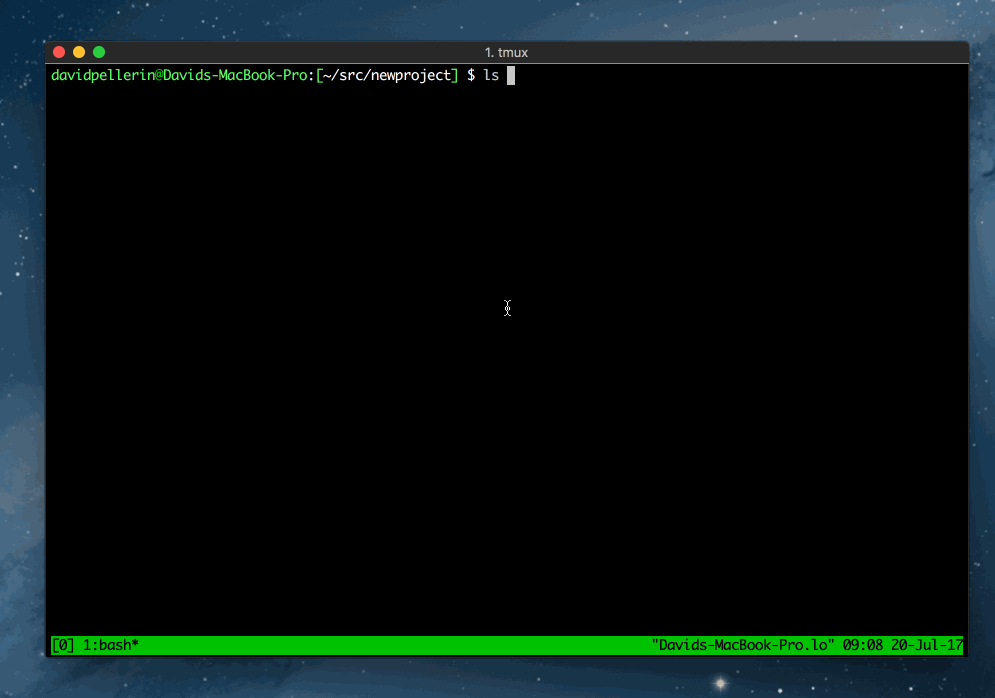

# generator-vagrant-chef

Yeoman generator to generate Vagrant / Chef devops repos

[](https://travis-ci.com/twg/generator-vagrant-chef)

## Screenshot



## Setup

Ensure you have the `yo` CLI installed:

```
npm i yo -g
```

Make the `vagrant-chef` generator available on your system:

```
git clone git@github.com:twg/generator-vagrant-chef.git
cd generator-vagrant-chef
npm link
```

Use the generator:

```
yo vagrant-chef
```

## Software

This generator supports the following technologies:

- Nginx
- Node.JS
- Yarn
- PostgreSQL
- Redis

Don't see a technology you need? [Please let us know!](https://github.com/twg/generator-vagrant-chef/issues/new)


## Testing

```bash
npm test
```

## Deploying Cookbooks to S3

This generator includes a script which allows you to easily package and upload your Chef cookbooks to Amazon S3.




## Getting To Know Yeoman

 * Yeoman has a heart of gold.
 * Yeoman is a person with feelings and opinions, but is very easy to work with.
 * Yeoman can be too opinionated at times but is easily convinced not to be.
 * Feel free to [learn more about Yeoman](http://yeoman.io/).

## License

Apache-2.0 © [TWG]()


[npm-image]: https://badge.fury.io/js/generator-vagrant-chef.svg
[npm-url]: https://npmjs.org/package/generator-vagrant-chef
[travis-image]: https://travis-ci.org/generator-vagrant-chef.svg?branch=master
[travis-url]: https://travis-ci.org/generator-vagrant-chef
[daviddm-image]: https://david-dm.org/generator-vagrant-chef.svg?theme=shields.io
[daviddm-url]: https://david-dm.org/generator-vagrant-chef
[coveralls-image]: https://coveralls.io/repos/generator-vagrant-chef/badge.svg
[coveralls-url]: https://coveralls.io/r/generator-vagrant-chef
